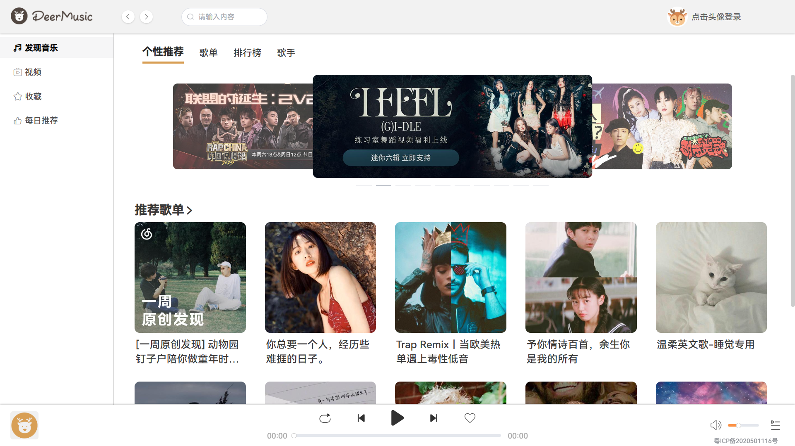
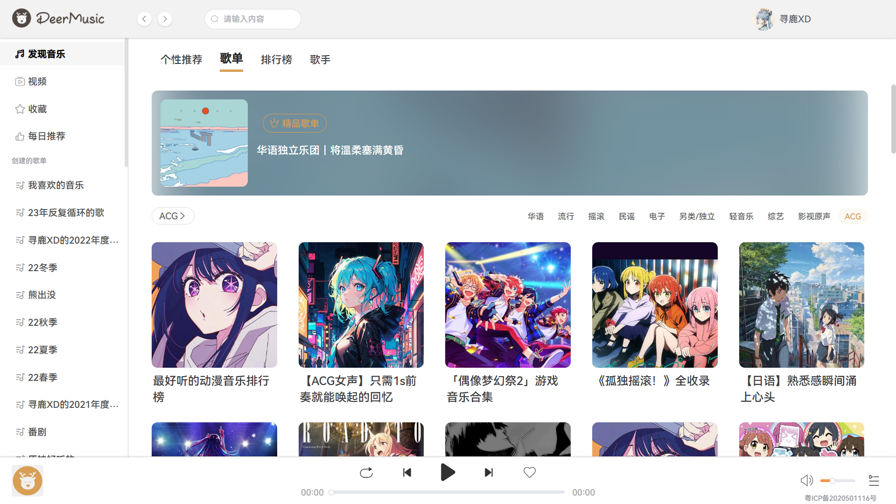
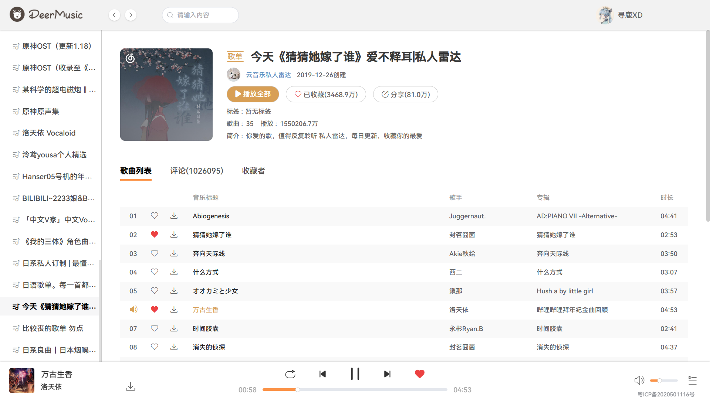
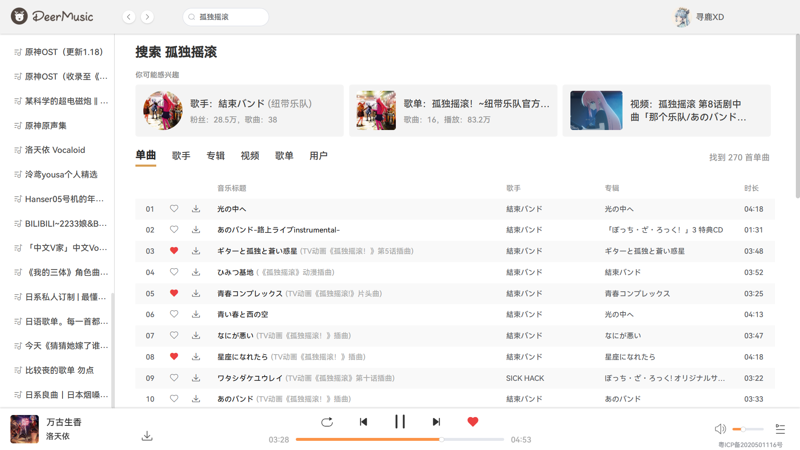
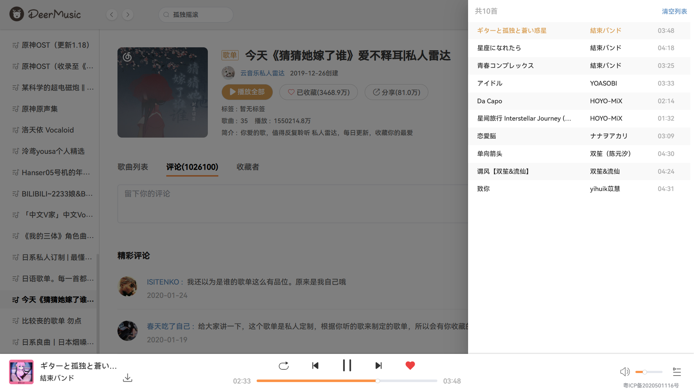
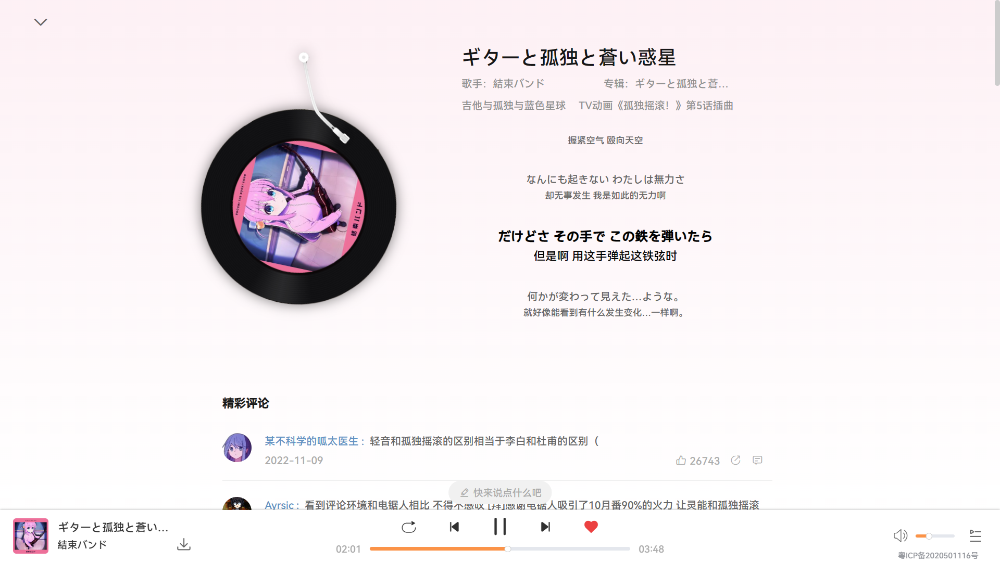
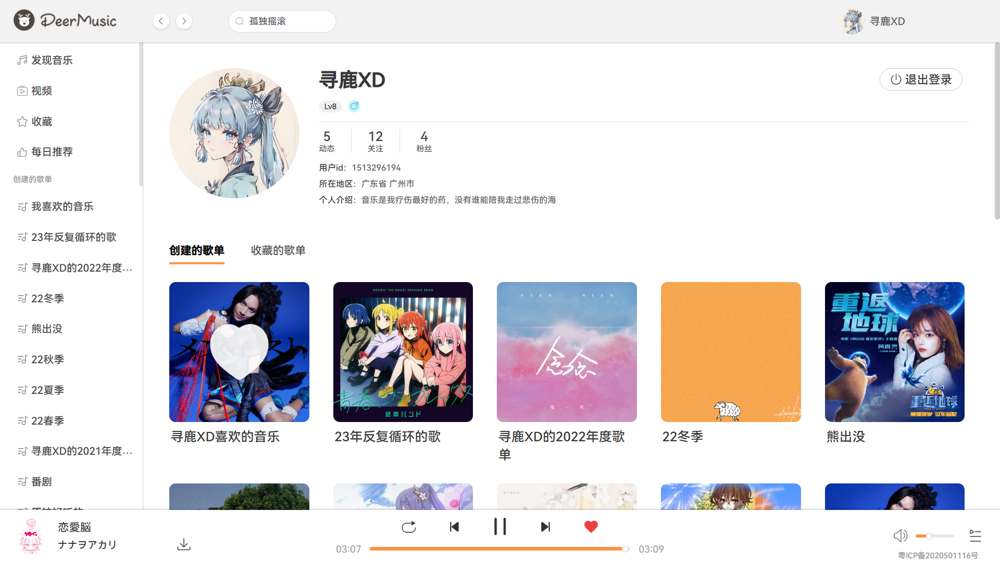

# deermusic


### 本人第一次发布作品，各位看官觉得不错的话，可以点个star嘛，谢谢啦！

### 我也正处于学习入门节段，各位大佬有什么建议都可以提哦！


## 项目参考

**[CodeMan / vue_cloud_music](https://gitee.com/PengGeee/vue_cloud_music)**


## 介绍

【vue全家桶练习项目】本项目是仿照网易云音乐客户端设计的线上音乐播放器（网页版），目前实现了页面基本样式、播放、歌词、歌单、搜索、扫码登录、点赞/喜欢、评论、收藏等基础功能，由于时间问题（本人正在备战考研），注册、手机号登录、视频、专辑、歌手等页面功能暂时没空做了，但是实现原理同歌单等已完成的页面，有空的话我会继续完善。

突出功能：监听渲染、歌词滚动、分析主题色、时间格式化等。

技术栈：**vue3 + element-plus**

- **另：项目注释非常良心，非常适合小白参考学习！**


## 线上demo

http://47.120.13.198:8088/

由于是免费试用期的服务器，就暂时没有申请域名和ssl证书，ip裸奔了，不要在意


## 本地项目搭建

- **本项目后端依赖于这个开源的网易云音乐API接口项目，请自行下载：**

**[NeteaseCloudMusicApi](https://github.com/Binaryify/NeteaseCloudMusicApi)**

### 1. 安装依赖项

```
npm install
```

### 2. 运行项目
```
npm run serve
```


## 部分页面展示

#### 首页



#### 歌单



#### 歌单详情



#### 搜索



#### 抽屉



#### 歌曲详情卡片



#### 个人主页




## 存在的问题

1. 发现音乐的个性推荐页的推荐歌单那个小箭头点击跳转歌单页面的功能暂时没写，因为涉及导航栏的渲染问题，设计的有点绕，摆了捏_(:з」∠)_
2. 精品歌单还可以做细一点，跟随当前分类展示精品歌单图片
3. 搜索单曲页面的播放效果样式没有做，因为有分页，不能直接简单的操作DOM，也可以做成无限滚动，或者根据索引渲染，但是太麻烦懒的搞了
4. 在收藏页面和每日推荐页面登录状态下刷新页面，会弹回发现页，原因是刷新时，要重新登录，而在未登录那个瞬间判定为未登录跳转回发现页
5. 喜欢的音乐如果较多，页面会加载巨慢，可能跟我的渲染逻辑代码有关，有待优化

## 注意

1. 千万不要频繁登录，否则网易云账号会被封禁一天！
2. URL非/m7和/m8的歌下载不了（这个应该是网易云设计的限制访问）
3. 单曲循环时，刚播放歌曲时直接拖到尾部或者点击上下一首是不会继续自动播放的，可能是因为网易后端有判断时间戳更新歌曲URL，URL没有更新audio就不会自动播放
